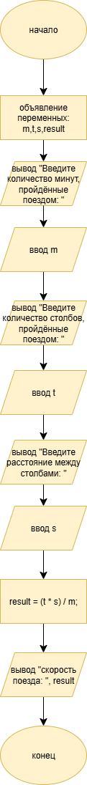

# Домашняя работа к лабораторной работе 3.
## Условия задачи:
Написать отладить программу пересчета числа прожитых лет в дни и месяцы
## 1. Алгоритм и блок схема:
### Алгоритм:
1. Начало
2. Задать исходные данные:
   - m = количество месяцев
   - d = количество дней
   - g = количество пожрожитых лет
  result =  скорость поезда
3. Расчитать количество прожитых месяцев и дней - 
   - m = g*12
   - d = g*365
4. Вывести результаты расчётов с подстановкой значений в текст.
5. Конец

### Блок схема

## 2. Реализация программы:
    #define _CRT_SECURE_NO_WARNINGS
    #include <stdio.h>
    #include <locale.h>
    
    void main()
    {
    	setlocale(LC_CTYPE, "RUS");
    	int g, m, d;
    	printf("Введие ваш возраст: ");
    	scanf("%d", &g);
    	m = g * 12;
    	d = g * 365;
    	printf(" %d - это %d месяцев или %d дней.",g, m, d);
    
    }
## 3. Результат работы программы

## 4. Информация о разработчике
Лаврова Мария, бИПТ-252# Lab2
